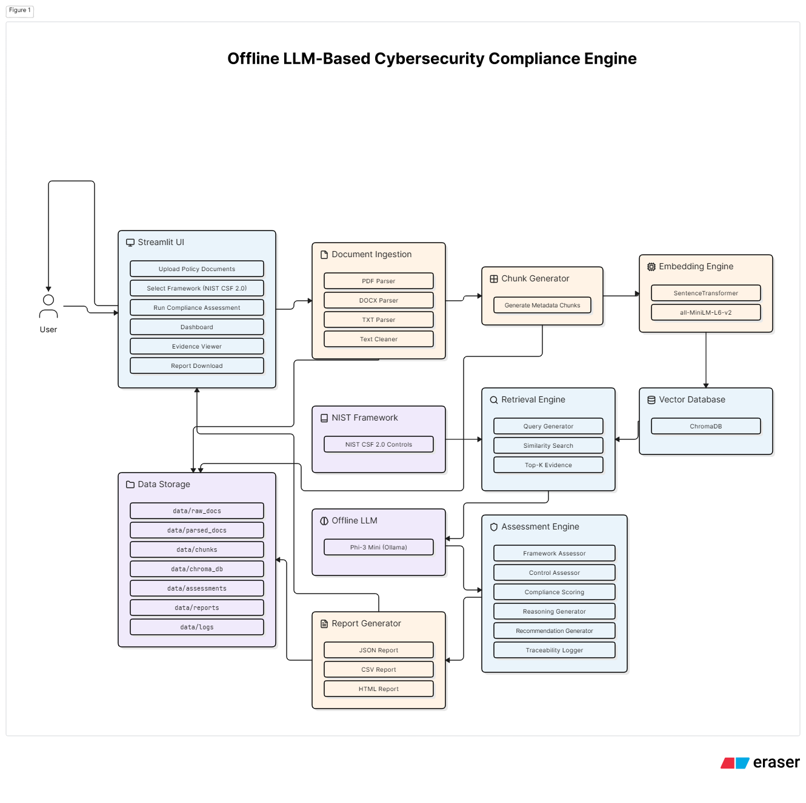
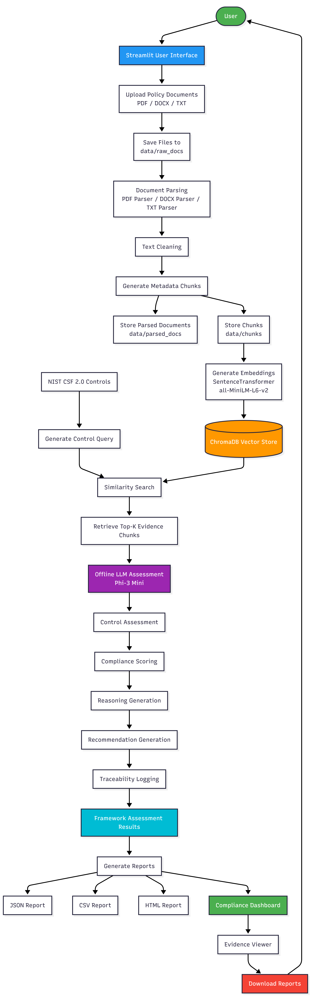

# Offline LLM-Based Cybersecurity Compliance Engine

## Project Overview

Organizations often struggle to determine whether their internal cybersecurity policies align with established security frameworks such as the NIST Cybersecurity Framework (CSF) 2.0. Manual policy reviews are time-consuming, inconsistent, and difficult to scale across multiple documents.

This project aims to develop a fully offline, AI-powered Cybersecurity Compliance Engine that automatically evaluates organizational policy documents against selected NIST CSF 2.0 controls. The system leverages Retrieval-Augmented Generation (RAG), ChromaDB, local embedding models, and locally hosted Large Language Models (LLMs) to perform evidence-based compliance assessments while ensuring complete data privacy.

---

# Problem Statement

Organizations maintain multiple cybersecurity policies covering areas such as access control, risk management, data protection, incident response, and disaster recovery. Determining whether these policies satisfy cybersecurity standards is often a manual and resource-intensive process.

The objective of this project is to automate cybersecurity policy assessment by:

- Parsing policy documents
- Retrieving relevant evidence
- Mapping evidence to NIST CSF 2.0 controls
- Determining compliance status
- Generating recommendations for improvement

All processing is performed locally without reliance on cloud-based APIs.

---

# Objectives

The primary objectives of the project are:

- Build a fully offline compliance assessment engine
- Analyze cybersecurity policy documents
- Evaluate policies against selected NIST CSF 2.0 controls
- Retrieve supporting evidence from documents
- Classify controls as:
  - Compliant
  - Partially Compliant
  - Non-Compliant
  - Not Enough Evidence
- Generate compliance reports and recommendations

---

# NIST CSF 2.0 Usage

This project uses the NIST Cybersecurity Framework (CSF) 2.0 as the baseline cybersecurity standard.

The framework organizes cybersecurity activities into six core functions:

1. Govern
2. Identify
3. Protect
4. Detect
5. Respond
6. Recover

For the Minimum Viable Product (MVP), a selected subset of approximately 20 important NIST CSF 2.0 controls is used for assessment.

---

# Key Features

- 100% Offline Execution
- Local LLM Integration using Ollama
- Local Embedding Generation
- ChromaDB Vector Storage
- Evidence-Based Compliance Assessment
- NIST CSF 2.0 Mapping
- Compliance Scoring
- Gap Identification
- Recommendation Generation

---

# Technology Stack

| Component | Technology |
|------------|------------|
| Programming Language | Python 3.10+ |
| LLM Runtime | Ollama |
| Language Models | TinyLlama / Phi-3 |
| Vector Database | ChromaDB |
| Embedding Model | all-MiniLM-L6-v2 |
| PDF Parsing | PyMuPDF |
| Retrieval Framework | LangChain |
| UI Prototype | Streamlit |

---

# Minimum Viable Product (MVP)

The MVP includes:

### Document Processing

- Upload cybersecurity policy documents
- Extract document text
- Parse PDF documents

### Retrieval Pipeline

- Create text chunks
- Generate embeddings
- Store embeddings in ChromaDB
- Retrieve relevant policy evidence

### Assessment Engine

- Map evidence to NIST controls
- Evaluate compliance status
- Generate assessment results

### Reporting

- Display compliance findings
- Show supporting evidence
- Generate recommendations

---
## Supported Input Formats

For the MVP, the compliance engine accepts the following document formats:

* PDF (.pdf)
* Microsoft Word Documents (.docx)
* Text Files (.txt)

The system is designed to process machine-readable documents where text can be directly extracted.

### Out of Scope for MVP

The following formats are not supported in the current version:

* Scanned PDFs containing only images
* JPEG, PNG, TIFF, or other image files
* Handwritten documents
* Screenshots of policies

These document types require Optical Character Recognition (OCR) techniques to extract text before compliance assessment can be performed.

# Out of Scope (Current Version)

The following features are not included in the MVP:

- Cloud Deployment
- User Authentication
- Multi-User Support
- Real-Time Monitoring
- SIEM Integration
- Continuous Compliance Tracking
- Regulatory Framework Mapping beyond NIST CSF 2.0
- Automated Remediation

---

# Project Structure

```text
compliance-engine/
│
├── data/
│   ├── raw_docs/
│   │   ├── policy_1.pdf
│   │   ├── policy_2.pdf
│   │   ├── policy_3.pdf
│   │   ├── policy_4.pdf
│   │   ├── policy_5.pdf
│   │   └── document_inventory.csv
│   │
│   ├── parsed_docs/
│   │
│   ├── chunks/
│   │
│   ├── chroma_db/
│   │
│   └── outputs/
│       └── sample_expected_output.json
│
├── frameworks/
│   ├── nist_csf_2_mvp.json
│   ├── assessment_status_rules.md
│   └── evidence_requirements.md
│
├── src/
│   ├── ingestion/
│   ├── chunking/
│   ├── embeddings/
│   ├── retrieval/
│   ├── llm/
│   ├── scoring/
│   └── reporting/
│
├── notebooks/
│
├── requirements.txt
├── README.md
└── run_assessment.py


##  System Architecture



---

##  Workflow



## Document Ingestion Pipeline

The ingestion pipeline converts cybersecurity policy documents into structured, machine-readable data for future compliance assessment against NIST CSF 2.0.

### Supported Formats

* PDF (.pdf)
* DOCX (.docx)
* TXT (.txt)

### Not Supported

* Images (.png, .jpg, .jpeg)
* Scanned/Image-based PDFs (OCR support planned in future versions)

### Workflow

Policy Document
→ Parsing
→ Text Cleaning
→ Chunk Generation
→ JSON Output
→ Embedding Ready Data

### Implemented Components

* PDF Parser
* DOCX Parser
* TXT Parser
* Text Cleaning Module
* Chunk Generation Module
* Processing Summary Report

### Output Locations

* Parsed Documents: `data/parsed_docs/`
* Generated Chunks: `data/chunks/`
* Processing Statistics: `data/outputs/processing_summary.json`

### Next Phase

The generated chunks will be used for embedding creation, ChromaDB storage, semantic retrieval, and NIST CSF 2.0 compliance assessment.


# Folder Description

| Folder/File | Purpose |
|------------|----------|
| data/raw_docs | Original policy documents |
| data/parsed_docs | Extracted text from documents |
| data/chunks | Generated text chunks |
| data/chroma_db | ChromaDB vector database |
| data/outputs | Assessment outputs and reports |
| frameworks | NIST controls and assessment definitions |
| src/ingestion | Document parsing logic |
| src/chunking | Text chunking logic |
| src/embeddings | Embedding generation logic |
| src/retrieval | Semantic retrieval logic |
| src/llm | LLM assessment logic |
| src/scoring | Compliance scoring engine |
| src/reporting | Report generation logic |
| notebooks | Prototypes and experimentation |
| run_assessment.py | Main execution script |

---

# Expected Workflow

## Step 1: Document Ingestion

Policy documents are uploaded and stored in the raw document repository.

## Step 2: Parsing

Documents are parsed and converted into clean text.

## Step 3: Chunking

Text is divided into smaller overlapping chunks.

## Step 4: Embedding Generation

Each chunk is converted into vector embeddings using a local embedding model.

## Step 5: Vector Storage

Embeddings are stored inside ChromaDB.

## Step 6: Evidence Retrieval

Relevant policy evidence is retrieved for each NIST control.

## Step 7: Compliance Assessment

The LLM evaluates retrieved evidence against control requirements.

## Step 8: Scoring

Controls are assigned compliance statuses.

## Step 9: Reporting

A final compliance assessment report is generated.

---

### Retrieval-Augmented Generation (RAG)

This project follows a Retrieval-Augmented Generation (RAG) approach for cybersecurity compliance assessment.

Workflow:

Policy Documents
        ↓
Document Parsing
        ↓
Text Cleaning
        ↓
Chunk Generation
        ↓
Embeddings (all-MiniLM-L6-v2)
        ↓
ChromaDB Vector Storage
        ↓
NIST CSF Control Query Generation
        ↓
Top-K Evidence Retrieval
        ↓
Compliance Assessment

Instead of sending entire policy documents to an LLM, the system first retrieves the most relevant evidence chunks from organizational policy documents. This improves accuracy, traceability, and explainability of compliance assessments.

Current Scope:
- PDF, DOCX, and TXT policy documents are supported.
- Text-based documents only.
- Scanned PDFs and image-based documents are not supported because OCR is outside the current project scope.

Future Work:
- OCR support for scanned documents.
- Hybrid retrieval (keyword + vector search).
- LLM-based evidence summarization.
- Automated compliance scoring.

# Assessment Status Categories

The assessment engine classifies controls into four categories:

### Compliant

Sufficient evidence exists demonstrating that the control is implemented.

### Partially Compliant

Some evidence exists, but implementation is incomplete or weak.

### Non-Compliant

No meaningful evidence exists showing implementation of the control.

### Not Enough Evidence

Available documents do not provide enough information to make a determination.

---
## Compliance Assessment Flow

1. Load NIST CSF 2.0 controls
2. Retrieve evidence from policy documents
3. Assess compliance status
      Compliant
      Partially Compliant
      Non-Compliant
Not Enough Evidence
4. Calculate deterministic confidence score
5. Generate recommendations for missing evidence.
6. Save assessment results
7. Generate framework report
8. Create traceability logs


## Output Artifacts
framework_assessment.json
framework_report.csv
traceability_log.json

# Expected Output

The final compliance engine should generate:

- Overall compliance score
- Control-by-control assessment
- Supporting evidence references
- Document source information
- Confidence scores
- Missing evidence identification
- Compliance recommendations

---

# Future Enhancements

Future versions may include:

- Advanced control scoring
- Multi-framework support
- Automated remediation suggestions
- Interactive dashboards
- Cloud deployment options
- Continuous compliance monitoring
-Future versions of the system may incorporate OCR-based processing using tools such as:

* Tesseract OCR
* EasyOCR
* PaddleOCR

This will allow the engine to assess scanned documents and image-based policies in addition to text-based documents.

---

### Retrieval Evaluation

The retrieval pipeline is evaluated using:

- Hit Rate@5
- Precision@5
- Recall@5
- Mean Reciprocal Rank (MRR)

These metrics help measure how effectively the system retrieves relevant evidence for NIST CSF 2.0 controls from the policy document corpus.

# Conclusion

The Offline LLM-Based Cybersecurity Compliance Engine demonstrates how Retrieval-Augmented Generation (RAG), local vector databases, and locally hosted language models can be used to automate cybersecurity policy compliance assessments while maintaining complete data privacy and offline operability. The project provides a scalable foundation for evidence-driven compliance evaluation aligned with the NIST Cybersecurity Framework 2.0.
